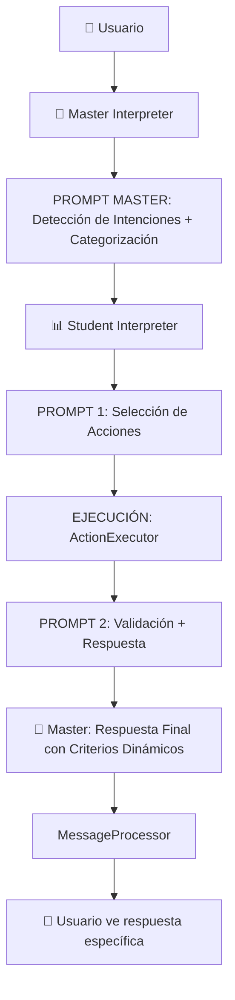

# 🔍 ANÁLISIS DETALLADO: PROMPTS DEL STUDENT INTERPRETER

## 📊 **FLUJO ACTUAL COMPLETO IDENTIFICADO**

### **🎯 TOTAL DE PROMPTS: 4 (1 Master + 3 Student) - ACTUALIZADO ENERO 2025**



## 🔍 **ANÁLISIS DETALLADO DE CADA PROMPT**

### **🧠 MASTER INTERPRETER - 1 PROMPT**

#### **PROMPT MASTER: Detección de Intenciones**
- **Archivo:** `app/core/ai/interpretation/master_interpreter.py`
- **Método:** `intention_detector.detect_intention()`
- **Propósito:** Detectar intención general (consulta_alumnos, ayuda_sistema, etc.)
- **Input:** Query del usuario + conversation_stack
- **Output:** `intention_type`, `sub_intention`, `detected_entities`, `confidence`

**¿QUÉ HACE?**
```python
# Analiza: "buscar García del turno matutino"
# Retorna: {
#   "intention_type": "consulta_alumnos",
#   "sub_intention": "busqueda_compleja", 
#   "detected_entities": ["García", "turno matutino"],
#   "confidence": 0.95
# }
```

### **📊 STUDENT INTERPRETER - 3 PROMPTS (ACTUALIZADO)**

#### **PROMPT 1: Intención Específica**
- **Archivo:** `app/core/ai/prompts/student_query_prompt_manager.py`
- **Método:** `get_specific_student_intention_prompt()`
- **Propósito:** Categorizar QUÉ ESPECÍFICAMENTE quiere sobre alumnos
- **Input:** Query + conversation_context
- **Output:** `categoria`, `sub_tipo`, `complejidad`, `flujo_optimo`

**¿QUÉ HACE?**
```python
# Analiza: "buscar García del turno matutino"
# Retorna: {
#   "categoria": "busqueda",
#   "sub_tipo": "complejo", 
#   "complejidad": "media",
#   "flujo_optimo": "sql_directo"
# }
```

**CATEGORÍAS QUE DETECTA:**
- `busqueda`: Buscar alumnos específicos
- `estadistica`: Conteos, promedios, análisis
- `reporte`: Listados completos organizados
- `constancia`: Generar documentos
- `transformacion`: Convertir formatos
- `continuacion`: Referencias a datos previos

#### **PROMPT 2: Selección de Acciones**
- **Archivo:** `app/core/ai/prompts/student_query_prompt_manager.py`
- **Método:** `get_action_selection_prompt()`
- **Propósito:** Elegir ACCIÓN del catálogo + generar parámetros
- **Input:** Query + categoria + conversation_context + database_structure + actions_catalog
- **Output:** `estrategia`, `accion_principal`, `parametros`, `acciones_adicionales`

**¿QUÉ HACE?**
```python
# Analiza: "buscar García del turno matutino"
# Retorna: {
#   "estrategia": "simple",
#   "accion_principal": "BUSCAR_UNIVERSAL",
#   "parametros": {
#     "criterio_principal": "nombre LIKE '%García%'",
#     "filtros_adicionales": [{"campo": "turno", "valor": "MATUTINO"}]
#   }
# }
```

**ACCIONES DISPONIBLES:**
- `BUSCAR_UNIVERSAL`: Búsqueda flexible con criterios múltiples
- `OBTENER_ALUMNO_EXACTO`: Un alumno específico por ID único
- `CALCULAR_ESTADISTICA`: Conteos y análisis numéricos
- `GENERAR_CONSTANCIA_COMPLETA`: Documentos oficiales
- `FILTRAR_POR_CALIFICACIONES`: Filtros de existencia de datos

#### **EJECUCIÓN: ActionExecutor (NO ES PROMPT)**
- **Archivo:** `app/core/ai/actions/action_executor.py`
- **Propósito:** Ejecutar la acción seleccionada con SQL
- **Input:** `accion_principal` + `parametros`
- **Output:** `data`, `sql_executed`, `row_count`, `success`

**¿QUÉ HACE?**
```python
# Ejecuta: BUSCAR_UNIVERSAL con parámetros
# Genera SQL: SELECT * FROM alumnos a JOIN datos_escolares de 
#             WHERE a.nombre LIKE '%García%' AND de.turno = 'MATUTINO'
# Retorna: {
#   "data": [lista_de_alumnos],
#   "sql_executed": "SELECT...",
#   "row_count": 3,
#   "success": True
# }
```

#### **PROMPT 4: Validación + Respuesta + Auto-reflexión**
- **Archivo:** `app/core/ai/interpretation/student_query_interpreter.py`
- **Método:** `_validate_and_generate_response()`
- **Propósito:** Generar respuesta conversacional + detectar continuación
- **Input:** Query + SQL + data + row_count + conversation_stack
- **Output:** `respuesta_usuario`, `reflexion_conversacional`

**¿QUÉ HACE?**
```python
# Analiza resultados y genera respuesta natural
# Retorna: {
#   "respuesta_usuario": "Encontré 3 alumnos García del turno matutino: Juan García, Ana García, Pedro García. ¿Necesitas información específica de alguno?",
#   "reflexion_conversacional": {
#     "espera_continuacion": True,
#     "tipo_esperado": "selection",
#     "datos_recordar": {"garcia_list": [...]}
#   }
# }
```

## 🎯 **FLUJO DE RESPUESTA AL USUARIO**

### **CADENA DE RESPUESTA ACTUAL:**

1. **PROMPT 4** genera `respuesta_usuario`
2. **StudentQueryInterpreter** retorna `InterpretationResult` con `human_response`
3. **MasterInterpreter** retorna resultado directamente (SIN PROCESAR)
4. **MessageProcessor** extrae `human_response` y lo envía al usuario

```python
# EN MessageProcessor línea 150:
message = result.parameters.get("human_response", 
                               result.parameters.get("message", "Consulta procesada"))
```

### **PUNTOS DONDE SE GENERA LA RESPUESTA:**

#### **PUNTO 1: PROMPT 4 - Respuesta Principal**
```python
# StudentQueryInterpreter._validate_and_generate_response()
conversational_response = self._generate_initial_query_response(
    user_query, final_row_count, final_data, espera_continuacion, context_stack
)
```

#### **PUNTO 2: ResponseGenerator - Respuesta con Reflexión**
```python
# response_generator.py
response_prompt = self.prompt_manager.get_response_with_reflection_prompt(
    user_query, sql_query, data, row_count
)
```

#### **PUNTO 3: Múltiples métodos de respuesta específica**
- `_generate_initial_query_response()` - Respuesta inicial
- `_generate_follow_up_response()` - Respuesta de seguimiento
- `_generate_specific_context_response()` - Respuesta con contexto específico

## ❌ **PROBLEMAS IDENTIFICADOS**

### **1. RESPUESTA FRAGMENTADA:**
- La respuesta se genera en **múltiples lugares**
- **PROMPT 4** es el principal, pero hay **fallbacks** y **casos especiales**
- **Inconsistencia** en el formato y estilo

### **2. MASTER NO PROCESA RESPUESTA:**
- Master recibe resultado del Student y lo **retorna directamente**
- **NO hay procesamiento** de la respuesta final
- **NO hay contextualización** estratégica

### **3. FALTA COMUNICACIÓN BIDIRECCIONAL:**
- Student **NO reporta** estado/ambigüedad al Master
- Master **NO sabe** si hubo problemas o ambigüedades
- **NO hay retroalimentación** para mejorar respuestas

### **4. REDUNDANCIA EN PROMPTS:**
- **PROMPT 1** y **PROMPT MASTER** hacen análisis similar
- Posible **consolidación** de funcionalidad

## 🎯 **OPORTUNIDADES DE OPTIMIZACIÓN**

### **OPCIÓN A: CONSOLIDAR PROMPT 1 CON MASTER**
```python
# ELIMINAR: PROMPT 1 (Intención Específica)
# EXPANDIR: PROMPT MASTER para incluir categorización específica
# RESULTADO: 4 PROMPTS TOTAL (1 Master expandido + 3 Student)
```

### **OPCIÓN B: CENTRALIZAR RESPUESTA EN MASTER**
```python
# MANTENER: 4 PROMPTS Student actuales
# AGREGAR: PROMPT MASTER final para procesar respuesta
# RESULTADO: 6 PROMPTS TOTAL (2 Master + 4 Student)
```

### **OPCIÓN C: UNIFICAR PROMPT 4 CON MASTER**
```python
# ELIMINAR: PROMPT 4 (Validación + Respuesta)
# MOVER: Generación de respuesta al Master
# RESULTADO: 4 PROMPTS TOTAL (1 Master + 3 Student + 1 Master final)
```

## 📋 **RECOMENDACIÓN TÉCNICA**

### **OPCIÓN B es la mejor** porque:

1. **Mantiene especialización** del Student en procesamiento técnico
2. **Centraliza respuesta** en Master para consistencia
3. **Permite comunicación bidireccional** sin romper flujo actual
4. **Fácil implementación** incremental

### **IMPLEMENTACIÓN RECOMENDADA:**

```python
# FLUJO PROPUESTO:
def interpret(context):
    # MASTER PROMPT 1: Detección de intenciones (mantener)
    intention = master_interpreter.detect_intention()
    
    # STUDENT PROMPTS 1-4: Flujo actual (mantener)
    student_result = student_interpreter.interpret(context)
    
    # NUEVO: Student genera reporte para Master
    student_report = {
        "status": "completed",
        "strategy_used": "BUSCAR_UNIVERSAL", 
        "results_summary": "3 alumnos García encontrados",
        "ambiguity_detected": False,
        "awaiting_continuation": True,
        "continuation_type": "selection",
        "original_response": student_result.human_response,
        "data": student_result.data
    }
    
    # NUEVO: MASTER PROMPT 2: Procesamiento de retroalimentación
    final_response = master_interpreter.process_student_feedback(
        student_report, original_query, conversation_stack
    )
    
    return final_response
```

## 🔍 **ANÁLISIS ESPECÍFICO DE REDUNDANCIAS**

### **REDUNDANCIA DETECTADA: PROMPT MASTER vs PROMPT 1**

#### **PROMPT MASTER (Detección de Intenciones):**
```python
# Analiza: "buscar García del turno matutino"
# Retorna: {
#   "intention_type": "consulta_alumnos",      # ✅ ÚTIL
#   "sub_intention": "busqueda_compleja",      # 🔄 REDUNDANTE
#   "detected_entities": ["García", "turno"],  # ✅ ÚTIL
#   "confidence": 0.95                         # ✅ ÚTIL
# }
```

#### **PROMPT 1 (Intención Específica):**
```python
# Analiza: "buscar García del turno matutino"
# Retorna: {
#   "categoria": "busqueda",          # 🔄 REDUNDANTE con sub_intention
#   "sub_tipo": "complejo",           # 🔄 REDUNDANTE con sub_intention
#   "complejidad": "media",           # ❓ NUEVO - ¿Es útil?
#   "flujo_optimo": "sql_directo"     # ❓ NUEVO - ¿Es útil?
# }
```

### **ANÁLISIS DE UTILIDAD:**

#### **INFORMACIÓN REDUNDANTE:**
- `sub_intention` (Master) ≈ `categoria` (Student)
- `busqueda_compleja` ≈ `busqueda` + `complejo`

#### **INFORMACIÓN ÚNICA DEL PROMPT 1:**
- `complejidad`: ¿Realmente se usa para algo?
- `flujo_optimo`: ¿Realmente influye en la ejecución?

#### **VERIFICACIÓN EN CÓDIGO:**
```python
# ¿Se usa complejidad en algún lugar?
# ¿Se usa flujo_optimo para decidir algo?
# ¿O solo se pasa al PROMPT 2 sin usar?
```

## 🎯 **PROPUESTAS DE OPTIMIZACIÓN ESPECÍFICAS**

### **PROPUESTA 1: CONSOLIDAR MASTER + PROMPT 1**

#### **VENTAJAS:**
- Elimina redundancia completa
- Reduce de 5 a 4 prompts totales
- Master más inteligente y específico
- Menos latencia de procesamiento

#### **DESVENTAJAS:**
- Master más complejo
- Posible pérdida de especialización

#### **IMPLEMENTACIÓN:**
```python
# NUEVO PROMPT MASTER EXPANDIDO:
def detect_comprehensive_intention(query, conversation_stack):
    """
    PROMPT MASTER EXPANDIDO que incluye:
    - intention_type (consulta_alumnos, ayuda, etc.)
    - categoria específica (busqueda, estadistica, etc.)
    - sub_tipo (simple, complejo, etc.)
    - detected_entities
    - confidence
    """
    return {
        "intention_type": "consulta_alumnos",
        "categoria": "busqueda",           # NUEVO: del PROMPT 1
        "sub_tipo": "complejo",            # NUEVO: del PROMPT 1
        "detected_entities": ["García"],
        "confidence": 0.95,
        "delegation_target": "student_query_interpreter"
    }
```

### **PROPUESTA 2: CONSOLIDAR PROMPT 4 CON MASTER**

#### **VENTAJAS:**
- Centraliza generación de respuesta
- Master controla tono y estilo
- Facilita comunicación bidireccional
- Respuestas más consistentes

#### **DESVENTAJAS:**
- Master necesita conocer detalles de datos
- Más complejidad en Master

#### **IMPLEMENTACIÓN:**
```python
# NUEVO FLUJO:
# Student ejecuta PROMPTS 1-3 + ActionExecutor
# Student retorna datos RAW + metadata
# Master genera respuesta final con PROMPT MASTER 2

def student_execute_technical(query):
    """Student se enfoca solo en obtener datos"""
    return {
        "data": [...],
        "sql_executed": "SELECT...",
        "row_count": 3,
        "action_used": "BUSCAR_UNIVERSAL",
        "execution_metadata": {...}
    }

def master_generate_response(student_result, query, conversation_stack):
    """Master genera respuesta conversacional"""
    return {
        "human_response": "Encontré 3 alumnos García...",
        "reflexion_conversacional": {...},
        "awaiting_continuation": True
    }
```

### **PROPUESTA 3: HÍBRIDA (RECOMENDADA)**

#### **COMBINAR AMBAS OPTIMIZACIONES:**
1. **Consolidar MASTER + PROMPT 1** (eliminar redundancia)
2. **Mantener PROMPT 4** pero agregar **MASTER FINAL**

#### **RESULTADO:**
- **PROMPTS TOTALES: 5** (igual que ahora)
- **DISTRIBUCIÓN:** 2 Master + 3 Student
- **FLUJO:** Master → Student (técnico) → Master (respuesta)

```python
# FLUJO HÍBRIDO OPTIMIZADO:
def process_query(user_query, conversation_stack):
    # MASTER PROMPT 1: Intención + Categoría (consolidado)
    intention = master.detect_comprehensive_intention(query, stack)

    # STUDENT PROMPT 2: Selección de acciones (mantener)
    action_request = student.select_actions(query, intention.categoria)

    # EJECUCIÓN: ActionExecutor (mantener)
    execution_result = action_executor.execute(action_request)

    # STUDENT PROMPT 4: Validación + respuesta técnica (mantener)
    student_response = student.validate_and_respond(query, execution_result)

    # MASTER PROMPT 2: Procesamiento bidireccional + respuesta final (NUEVO)
    final_response = master.process_student_feedback(
        student_response, query, conversation_stack
    )

    return final_response
```

## 📊 **COMPARACIÓN DE OPCIONES**

| Aspecto | Actual | Propuesta 1 | Propuesta 2 | Propuesta 3 |
|---------|--------|-------------|-------------|-------------|
| **Total Prompts** | 5 | 4 | 5 | 5 |
| **Master Prompts** | 1 | 1 | 2 | 2 |
| **Student Prompts** | 4 | 3 | 3 | 3 |
| **Redundancia** | Alta | Baja | Media | Baja |
| **Bidireccional** | No | No | Sí | Sí |
| **Complejidad** | Media | Baja | Alta | Media |
| **Riesgo** | Bajo | Medio | Alto | Medio |

## 🎯 **RECOMENDACIÓN FINAL**

### **PROPUESTA 3 (HÍBRIDA) es la mejor opción** porque:

1. **Elimina redundancia** entre Master y PROMPT 1
2. **Mantiene especialización** del Student en procesamiento técnico
3. **Agrega comunicación bidireccional** con Master final
4. **Riesgo controlado** - cambios incrementales
5. **Mejora significativa** sin romper arquitectura actual

### **PLAN DE IMPLEMENTACIÓN:**

#### **FASE 1: Consolidar Master + PROMPT 1 (2 horas)**
- Expandir PROMPT MASTER para incluir categorización
- Eliminar PROMPT 1 del Student
- Ajustar PROMPT 2 para recibir categoría del Master

#### **FASE 2: Agregar Master Final (2 horas)**
- Crear PROMPT MASTER 2 para procesamiento bidireccional
- Modificar Student para generar reporte técnico
- Integrar comunicación bidireccional

#### **FASE 3: Pruebas y optimización (1 hora)**
- Validar que funciona igual que antes
- Probar casos de ambigüedad
- Verificar mejoras en respuestas

## 🎯 **EXPLICACIÓN DETALLADA DEL FLUJO OPTIMIZADO**

### **❌ ACLARACIÓN IMPORTANTE: NO ES RECURSIÓN NI REINICIO**

#### **LO QUE NO ES:**
- ❌ NO hay recursión o reinicio del proceso
- ❌ NO se vuelve a ejecutar todo el flujo
- ❌ NO es comunicación infinita entre Master y Student
- ❌ NO cambia el manejo de la pila conversacional

#### **LO QUE SÍ ES:**
- ✅ Es **UNA SOLA PASADA** con **retroalimentación simple**
- ✅ Student le **reporta** al Master cómo salió todo
- ✅ Master **mejora la respuesta** con ese reporte
- ✅ **UNA VEZ** y ya termina
- ✅ La pila conversacional sigue funcionando igual

## 🔄 **COMPARACIÓN: FLUJO ACTUAL vs OPTIMIZADO**

### **FLUJO ACTUAL (PROBLEMA):**
```
👤 "buscar García"
    ↓
🧠 Master: "es consulta_alumnos"
    ↓
📊 Student: hace todo el trabajo + genera respuesta
    ↓
👤 Ve respuesta directamente (Master no sabe qué pasó)
```

### **FLUJO OPTIMIZADO (SOLUCIÓN):**
```
👤 "buscar García"
    ↓
🧠 Master Prompt 1: "es consulta_alumnos, categoría busqueda"
    ↓
📊 Student Prompt 1: "usar BUSCAR_UNIVERSAL"
    ↓
⚙️ ActionExecutor: ejecuta SQL → 5 García encontrados
    ↓
📊 Student Prompt 2: "encontré 5, hay ambigüedad, usuario debe especificar"
    ↓
🧠 Master Prompt 2: "ok, 5 García es ambiguo, muestro resultados Y pido clarificación"
    ↓
👤 Ve respuesta mejorada con datos + pregunta inteligente
```

---

## ✅ **ESTADO ACTUAL IMPLEMENTADO - ENERO 2025**

### **🎯 FLUJO CONSOLIDADO FUNCIONANDO:**

#### **MASTER INTERPRETER - 1 PROMPT EXPANDIDO:**
- **Detección de intenciones** ✅
- **Categorización específica** ✅ (incluye información del antiguo PROMPT 1)
- **Entidades detectadas** ✅
- **Delegación inteligente** ✅

#### **STUDENT INTERPRETER - 2 PROMPTS PRINCIPALES:**
- **PROMPT 1: Selección de acciones** ✅ (antiguo PROMPT 2)
- **PROMPT 2: Validación + respuesta** ✅ (antiguo PROMPT 4)
- **ActionExecutor entre prompts** ✅

#### **MASTER RESPUESTA FINAL:**
- **Análisis dinámico de SQL** ✅
- **Extracción de criterios específicos** ✅
- **Respuestas con criterios mencionados** ✅
- **Centralización de respuestas** ✅

### **🔧 OPTIMIZACIONES IMPLEMENTADAS:**

1. **ELIMINADO PROMPT 1 REDUNDANTE** ✅
   - Master ahora incluye categorización específica
   - Información consolidada en un solo lugar

2. **RESPUESTAS DINÁMICAS** ✅
   - Análisis automático del SQL ejecutado
   - Extracción de criterios de búsqueda
   - Respuestas específicas: "12 alumnos de 1° grado turno VESPERTINO"

3. **CONTEXTO CONVERSACIONAL DESACTIVADO** ✅
   - Procesamiento individual por consulta
   - Sin auto-reflexión conversacional
   - Enfoque en robustez de consultas individuales

### **📊 ACCIONES UNIVERSALES IMPLEMENTADAS:**
- **BUSCAR_UNIVERSAL** ✅ - Búsqueda con criterios múltiples
- **CONTAR_UNIVERSAL** ✅ - Conteos con criterios múltiples
- **Análisis dinámico de criterios** ✅ - Para todas las consultas

---

## 📋 **CADA PROMPT EXPLICADO EN DETALLE**

### **🧠 MASTER PROMPT 1: "¿QUÉ QUIERE EL USUARIO?"**

#### **¿Por qué es necesario?**
- Alguien tiene que entender la intención general del usuario
- Decidir a quién delegar (Student, Help, Constancia, etc.)
- Detectar si necesita contexto conversacional de la pila
- **ELIMINA REDUNDANCIA** con el Student Prompt 1 actual

#### **¿Qué hace específicamente?**
```python
# ANTES (2 prompts separados con redundancia):
Master: "es consulta_alumnos"
Student Prompt 1: "es búsqueda compleja"  # ← REDUNDANTE

# DESPUÉS (1 prompt consolidado):
Master: "es consulta_alumnos, categoría búsqueda, tipo complejo"  # ← TODO EN UNO
```

#### **Entrada:**
```python
{
    "user_query": "buscar García del turno matutino",
    "conversation_stack": [
        {
            "nivel": 1,
            "consulta": "alumnos de 2do A",
            "datos": [...],
            "timestamp": "..."
        }
    ]
}
```

#### **Salida:**
```python
{
    "intention_type": "consulta_alumnos",
    "categoria": "busqueda",                    # NUEVO: del Student Prompt 1 eliminado
    "sub_tipo": "complejo",                     # NUEVO: del Student Prompt 1 eliminado
    "detected_entities": ["García", "turno matutino"],
    "confidence": 0.95,
    "requires_context": True,                   # NUEVO: si necesita pila conversacional
    "delegation_target": "student_query_interpreter"
}
```

---

### **📊 STUDENT PROMPT 1: "¿CÓMO LO RESUELVO TÉCNICAMENTE?"**

#### **¿Por qué es necesario?**
- Alguien técnico tiene que decidir QUÉ ACCIÓN específica usar
- Convertir intención humana en acción técnica ejecutable
- Generar parámetros específicos para el ActionExecutor
- **ESPECIALIZACIÓN TÉCNICA** - el Master no debe saber de SQL

#### **¿Qué hace específicamente?**
```python
# Recibe del Master: "es búsqueda compleja con entidades García y turno matutino"
# Decide técnicamente: "usar BUSCAR_UNIVERSAL con estos parámetros SQL específicos"
```

#### **Entrada:**
```python
{
    "user_query": "buscar García del turno matutino",
    "master_analysis": {
        "categoria": "busqueda",
        "sub_tipo": "complejo",
        "detected_entities": ["García", "turno matutino"],
        "requires_context": True
    },
    "database_structure": {...},
    "available_actions": [...]
}
```

#### **Salida:**
```python
{
    "estrategia": "simple",
    "accion_principal": "BUSCAR_UNIVERSAL",
    "parametros": {
        "criterio_principal": "nombre LIKE '%García%'",
        "filtros_adicionales": [
            {"campo": "turno", "valor": "MATUTINO"}
        ],
        "usar_contexto_conversacional": True
    },
    "razonamiento": "Búsqueda compleja con múltiples criterios detectados por Master"
}
```

---

### **⚙️ ACTIONEXECUTOR: "EJECUTAR LA ACCIÓN TÉCNICA"**

#### **¿Por qué es necesario?**
- Alguien tiene que generar el SQL real y ejecutarlo
- Obtener los datos reales de la base de datos
- **NO ES UN PROMPT** - es ejecución pura

#### **Entrada:**
```python
{
    "accion_principal": "BUSCAR_UNIVERSAL",
    "parametros": {
        "criterio_principal": "nombre LIKE '%García%'",
        "filtros_adicionales": [{"campo": "turno", "valor": "MATUTINO"}]
    }
}
```

#### **Salida:**
```python
{
    "success": True,
    "data": [
        {"id": 1, "nombre": "JUAN GARCÍA", "turno": "MATUTINO", "grado": "2", "grupo": "A"},
        {"id": 2, "nombre": "ANA GARCÍA", "turno": "MATUTINO", "grado": "3", "grupo": "B"},
        {"id": 3, "nombre": "PEDRO GARCÍA", "turno": "MATUTINO", "grado": "1", "grupo": "C"},
        {"id": 4, "nombre": "LUIS GARCÍA", "turno": "MATUTINO", "grado": "4", "grupo": "A"},
        {"id": 5, "nombre": "MARÍA GARCÍA", "turno": "MATUTINO", "grado": "5", "grupo": "B"}
    ],
    "row_count": 5,
    "sql_executed": "SELECT * FROM alumnos a JOIN datos_escolares de WHERE a.nombre LIKE '%García%' AND de.turno = 'MATUTINO'",
    "execution_time": 0.05
}
```

---

### **📊 STUDENT PROMPT 2: "¿CÓMO SALIÓ LA EJECUCIÓN?"**

#### **¿Por qué es necesario?**
- Alguien técnico tiene que validar si los datos obtenidos son correctos
- Detectar problemas técnicos (ambigüedad, pocos datos, errores, etc.)
- Generar un **reporte técnico detallado** para que el Master tome decisiones
- **ANÁLISIS TÉCNICO** - el Master no debe analizar datos SQL

#### **¿Qué hace específicamente?**
```python
# Analiza técnicamente: "obtuve 5 García, eso es ambiguo para el usuario"
# Genera reporte: "hay ambigüedad múltiple, usuario necesita especificar, pero datos son válidos"
```

#### **Entrada:**
```python
{
    "user_query": "buscar García del turno matutino",
    "action_result": {
        "data": [5 alumnos García],
        "row_count": 5,
        "sql_executed": "SELECT..."
    },
    "conversation_stack": [...]
}
```

#### **Salida:**
```python
{
    "respuesta_tecnica": "Búsqueda ejecutada exitosamente. 5 registros válidos encontrados.",
    "datos_validados": [
        {"id": 1, "nombre": "JUAN GARCÍA", "turno": "MATUTINO", "grado": "2", "grupo": "A"},
        {"id": 2, "nombre": "ANA GARCÍA", "turno": "MATUTINO", "grado": "3", "grupo": "B"},
        {"id": 3, "nombre": "PEDRO GARCÍA", "turno": "MATUTINO", "grado": "1", "grupo": "C"},
        {"id": 4, "nombre": "LUIS GARCÍA", "turno": "MATUTINO", "grado": "4", "grupo": "A"},
        {"id": 5, "nombre": "MARÍA GARCÍA", "turno": "MATUTINO", "grado": "5", "grupo": "B"}
    ],
    "reflexion_conversacional": {
        "espera_continuacion": True,
        "tipo_esperado": "selection",
        "datos_recordar": {"garcia_results": [...]}
    },
    "execution_report": {
        "status": "completed_with_ambiguity",
        "strategy_used": "BUSCAR_UNIVERSAL",
        "results_summary": "5 alumnos García del turno matutino encontrados",
        "ambiguity_detected": True,
        "ambiguity_type": "multiple_matches",
        "ambiguity_reason": "Múltiples alumnos con apellido García",
        "awaiting_continuation": True,
        "continuation_type": "clarification",
        "data_quality": "excellent",
        "technical_issues": "none"
    }
}
```

---

### **🧠 MASTER PROMPT 2: "¿CÓMO SE LO COMUNICO AL USUARIO?"**

#### **¿Por qué es necesario?**
- El Student es técnico, el Master es conversacional y estratégico
- Alguien tiene que convertir reporte técnico en respuesta humana natural
- Decidir el tono, estilo y estrategia de comunicación
- **MANTENER CONTINUIDAD** - mostrar datos Y pedir clarificación cuando sea necesario

#### **¿Qué hace específicamente?**
```python
# Recibe reporte técnico: "hay ambigüedad, 5 García válidos"
# Genera respuesta estratégica: "Muestro los 5 García Y pregunto cuál específicamente"
# MANTIENE CONTINUIDAD: usuario ve resultados útiles + puede especificar
```

#### **Entrada:**
```python
{
    "original_query": "buscar García del turno matutino",
    "student_report": {
        "status": "completed_with_ambiguity",
        "results_summary": "5 alumnos García del turno matutino encontrados",
        "ambiguity_detected": True,
        "ambiguity_type": "multiple_matches",
        "awaiting_continuation": True,
        "continuation_type": "clarification",
        "datos_validados": [5 alumnos García con detalles]
    },
    "conversation_stack": [...],
    "master_initial_analysis": {...}
}
```

#### **Salida:**
```python
{
    "human_response": "Encontré 5 alumnos García del turno matutino:\n\n1. **Juan García** - 2° grado grupo A\n2. **Ana García** - 3° grado grupo B\n3. **Pedro García** - 1° grado grupo C\n4. **Luis García** - 4° grado grupo A\n5. **María García** - 5° grado grupo B\n\n¿Te refieres a alguno en particular? Puedes especificar el nombre completo o el grado.",
    "conversation_update": {
        "add_to_stack": True,
        "context_for_next": "garcia_search_results_multiple",
        "awaiting_followup": True
    },
    "system_feedback": {
        "student_performance": "excellent",
        "strategy_effectiveness": "high",
        "response_quality": "natural_with_continuity"
    }
}
```

## 🔄 **COMUNICACIÓN BIDIRECCIONAL EXPLICADA**

### **¿QUÉ SIGNIFICA "BIDIRECCIONAL"?**

#### **ANTES (Unidireccional):**
```
Master → Student → Usuario
       ↓
   "Hazlo"    "Listo" (Master no sabe cómo salió)
```

#### **DESPUÉS (Bidireccional):**
```
Master → Student → Master → Usuario
       ↓         ↑       ↓
   "Hazlo"   "Salió así"  "Ok, le digo esto estratégicamente"
```

### **¿CUÁNDO SE COMUNICAN?**

**UNA SOLA VEZ por consulta:**
1. Master le dice al Student qué hacer
2. Student hace el trabajo técnico
3. Student le reporta al Master cómo salió (datos + problemas + análisis)
4. Master genera la respuesta final estratégica
5. **FIN** - no hay más comunicación hasta la próxima consulta del usuario

### **¿QUÉ PASA CON LA PILA CONVERSACIONAL?**

**SE MANTIENE EXACTAMENTE IGUAL:**
- La pila conversacional sigue funcionando igual que antes
- Cuando el usuario hace una pregunta de seguimiento, el **Master Prompt 1** detecta que es continuación
- Usa el contexto de la pila para entender la referencia ("el segundo", "para él", etc.)
- **NO hay comunicación adicional** - es el mismo flujo de siempre para continuaciones

## 📊 **CASOS DE EJEMPLO DETALLADOS**

### **CASO 1: Consulta Sin Ambigüedad**

#### **Flujo Completo:**
```
👤 "alumnos de 2do A turno matutino"
    ↓
🧠 Master Prompt 1:
   Entrada: "alumnos de 2do A turno matutino"
   Salida: {
     "intention_type": "consulta_alumnos",
     "categoria": "busqueda",
     "sub_tipo": "especifico",
     "detected_entities": ["2do", "A", "turno matutino"]
   }
    ↓
📊 Student Prompt 1:
   Entrada: Master analysis + query
   Salida: {
     "accion_principal": "BUSCAR_UNIVERSAL",
     "parametros": {
       "criterio_principal": "grado = '2' AND grupo = 'A'",
       "filtros_adicionales": [{"campo": "turno", "valor": "MATUTINO"}]
     }
   }
    ↓
⚙️ ActionExecutor:
   Entrada: BUSCAR_UNIVERSAL + parámetros
   Salida: {
     "data": [11 alumnos específicos],
     "row_count": 11,
     "sql_executed": "SELECT * FROM alumnos..."
   }
    ↓
📊 Student Prompt 2:
   Entrada: Query + 11 resultados
   Salida: {
     "execution_report": {
       "status": "completed_successfully",
       "ambiguity_detected": False,
       "awaiting_continuation": False,
       "data_quality": "excellent"
     }
   }
    ↓
🧠 Master Prompt 2:
   Entrada: Student report (sin ambigüedad)
   Salida: {
     "human_response": "Encontré 11 alumnos de 2° grado grupo A del turno matutino: [lista completa con nombres]"
   }
    ↓
👤 "Encontré 11 alumnos de 2° grado grupo A del turno matutino: Juan Pérez, Ana López, Carlos García..."
```

### **CASO 2: Consulta Con Ambigüedad (MEJORADO - CON DATOS + CLARIFICACIÓN)**

#### **Flujo Completo:**
```
👤 "buscar García"
    ↓
🧠 Master Prompt 1:
   Entrada: "buscar García"
   Salida: {
     "intention_type": "consulta_alumnos",
     "categoria": "busqueda",
     "sub_tipo": "simple",
     "detected_entities": ["García"]
   }
    ↓
📊 Student Prompt 1:
   Entrada: Master analysis + query
   Salida: {
     "accion_principal": "BUSCAR_UNIVERSAL",
     "parametros": {
       "criterio_principal": "nombre LIKE '%García%'"
     }
   }
    ↓
⚙️ ActionExecutor:
   Entrada: BUSCAR_UNIVERSAL + parámetros
   Salida: {
     "data": [
       {"id": 1, "nombre": "JUAN GARCÍA", "turno": "MATUTINO", "grado": "2", "grupo": "A"},
       {"id": 2, "nombre": "ANA GARCÍA", "turno": "MATUTINO", "grado": "3", "grupo": "B"},
       {"id": 3, "nombre": "PEDRO GARCÍA", "turno": "VESPERTINO", "grado": "1", "grupo": "C"},
       {"id": 4, "nombre": "LUIS GARCÍA", "turno": "MATUTINO", "grado": "4", "grupo": "A"},
       {"id": 5, "nombre": "MARÍA GARCÍA", "turno": "VESPERTINO", "grado": "5", "grupo": "B"}
     ],
     "row_count": 5
   }
    ↓
📊 Student Prompt 2:
   Entrada: Query + 5 García encontrados
   Salida: {
     "execution_report": {
       "status": "completed_with_ambiguity",
       "ambiguity_detected": True,
       "ambiguity_type": "multiple_matches",
       "ambiguity_reason": "Múltiples alumnos con apellido García",
       "awaiting_continuation": True,
       "continuation_type": "clarification",
       "data_quality": "excellent"
     },
     "datos_validados": [5 alumnos García completos]
   }
    ↓
🧠 Master Prompt 2:
   Entrada: Student report (con ambigüedad + datos válidos)
   Análisis: "Hay ambigüedad PERO los datos son útiles. Estrategia: mostrar resultados Y pedir clarificación para mantener continuidad"
   Salida: {
     "human_response": "Encontré 5 alumnos García:\n\n1. **Juan García** - 2° grado grupo A (turno matutino)\n2. **Ana García** - 3° grado grupo B (turno matutino)\n3. **Pedro García** - 1° grado grupo C (turno vespertino)\n4. **Luis García** - 4° grado grupo A (turno matutino)\n5. **María García** - 5° grado grupo B (turno vespertino)\n\n¿Te refieres a alguno en particular? Puedes especificar el nombre completo, grado o turno."
   }
    ↓
👤 Ve: "Encontré 5 alumnos García: [lista detallada] ¿Te refieres a alguno en particular?"
```

**🎯 BENEFICIO CLAVE DEL CASO 2:**
- ✅ Usuario VE los resultados útiles (puede que esté el que busca)
- ✅ Usuario PUEDE especificar si necesita otro
- ✅ Se MANTIENE la continuidad y utilidad
- ✅ Master toma decisión estratégica inteligente

### **CASO 3: Consulta de Continuación (IGUAL QUE ANTES)**

#### **Flujo Completo:**
```
👤 "constancia para el segundo" (después del Caso 2)
    ↓
🧠 Master Prompt 1:
   Entrada: "constancia para el segundo" + pila conversacional (García results)
   Salida: {
     "intention_type": "consulta_alumnos",
     "categoria": "continuacion",
     "sub_tipo": "referencia",
     "detected_entities": ["constancia", "segundo"],
     "requires_context": True,
     "context_type": "reference_to_previous"
   }
    ↓
📊 Student Prompt 1:
   Entrada: Master analysis + contexto de pila
   Salida: {
     "accion_principal": "GENERAR_CONSTANCIA_COMPLETA",
     "parametros": {
       "alumno_id": 2,  # Ana García (el segundo de la lista)
       "tipo_constancia": "estudios",
       "usar_contexto_previo": True
     }
   }
    ↓
⚙️ ActionExecutor:
   Entrada: GENERAR_CONSTANCIA_COMPLETA + parámetros
   Salida: {
     "data": {"constancia_generada": True, "archivo": "constancia_ana_garcia.pdf"},
     "row_count": 1,
     "success": True
   }
    ↓
📊 Student Prompt 2:
   Entrada: Query + constancia generada exitosamente
   Salida: {
     "execution_report": {
       "status": "completed_successfully",
       "ambiguity_detected": False,
       "awaiting_continuation": False,
       "data_quality": "excellent",
       "action_completed": "constancia_generated"
     }
   }
    ↓
🧠 Master Prompt 2:
   Entrada: Student report (constancia exitosa)
   Salida: {
     "human_response": "Constancia de estudios generada exitosamente para **Ana García** (3° grado grupo B). El documento está listo para descargar."
   }
    ↓
👤 "Constancia de estudios generada exitosamente para Ana García. El documento está listo para descargar."
```

### **CASO 4: Consulta Estadística**

#### **Flujo Completo:**
```
👤 "cuántos alumnos hay en cada grado"
    ↓
🧠 Master Prompt 1:
   Entrada: "cuántos alumnos hay en cada grado"
   Salida: {
     "intention_type": "consulta_alumnos",
     "categoria": "estadistica",
     "sub_tipo": "conteo",
     "detected_entities": ["cuántos", "cada grado"]
   }
    ↓
📊 Student Prompt 1:
   Entrada: Master analysis + query
   Salida: {
     "accion_principal": "CALCULAR_ESTADISTICA",
     "parametros": {
       "tipo_calculo": "count_by_field",
       "campo_agrupacion": "grado",
       "incluir_totales": True
     }
   }
    ↓
⚙️ ActionExecutor:
   Entrada: CALCULAR_ESTADISTICA + parámetros
   Salida: {
     "data": [
       {"grado": "1", "total_alumnos": 29},
       {"grado": "2", "total_alumnos": 33},
       {"grado": "3", "total_alumnos": 31},
       {"grado": "4", "total_alumnos": 28},
       {"grado": "5", "total_alumnos": 27},
       {"grado": "6", "total_alumnos": 25}
     ],
     "row_count": 6,
     "total_general": 173
   }
    ↓
📊 Student Prompt 2:
   Entrada: Query + estadísticas calculadas
   Salida: {
     "execution_report": {
       "status": "completed_successfully",
       "ambiguity_detected": False,
       "awaiting_continuation": True,
       "continuation_type": "analysis",
       "data_quality": "excellent",
       "analysis_ready": True
     }
   }
    ↓
🧠 Master Prompt 2:
   Entrada: Student report (estadísticas listas)
   Salida: {
     "human_response": "Distribución de alumnos por grado:\n\n📊 **1° grado:** 29 alumnos\n📊 **2° grado:** 33 alumnos\n📊 **3° grado:** 31 alumnos\n📊 **4° grado:** 28 alumnos\n📊 **5° grado:** 27 alumnos\n📊 **6° grado:** 25 alumnos\n\n**Total general:** 173 alumnos\n\n¿Te interesa información específica de algún grado?"
   }
    ↓
👤 "Distribución de alumnos por grado: [estadísticas detalladas] ¿Te interesa información específica de algún grado?"
```

## 🎯 **PRINCIPIOS CLAVE DE LA COMUNICACIÓN BIDIRECCIONAL**

### **1. MANTENER CONTINUIDAD:**
- Siempre mostrar datos útiles cuando existan
- Preguntar por clarificación SIN perder los resultados obtenidos
- El usuario nunca debe sentir que "perdió" información

### **2. ESTRATEGIA INTELIGENTE DEL MASTER:**
- Student reporta técnicamente: "hay ambigüedad"
- Master decide estratégicamente: "muestro datos Y pido clarificación"
- Resultado: usuario satisfecho con información útil

### **3. ESPECIALIZACIÓN CLARA:**
- Student: experto técnico (SQL, datos, validación)
- Master: experto conversacional (tono, estrategia, continuidad)
- Cada uno hace lo que mejor sabe hacer

### **4. UNA SOLA PASADA:**
- No hay loops infinitos ni recursión
- Flujo lineal: Master → Student → Master → Usuario
- Comunicación bidireccional simple y efectiva

---

**🎯 DOCUMENTACIÓN COMPLETA DEL FLUJO OPTIMIZADO - LISTA PARA IMPLEMENTACIÓN**
